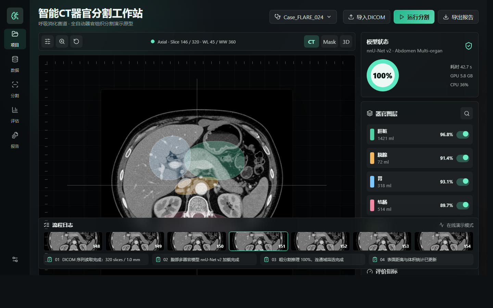
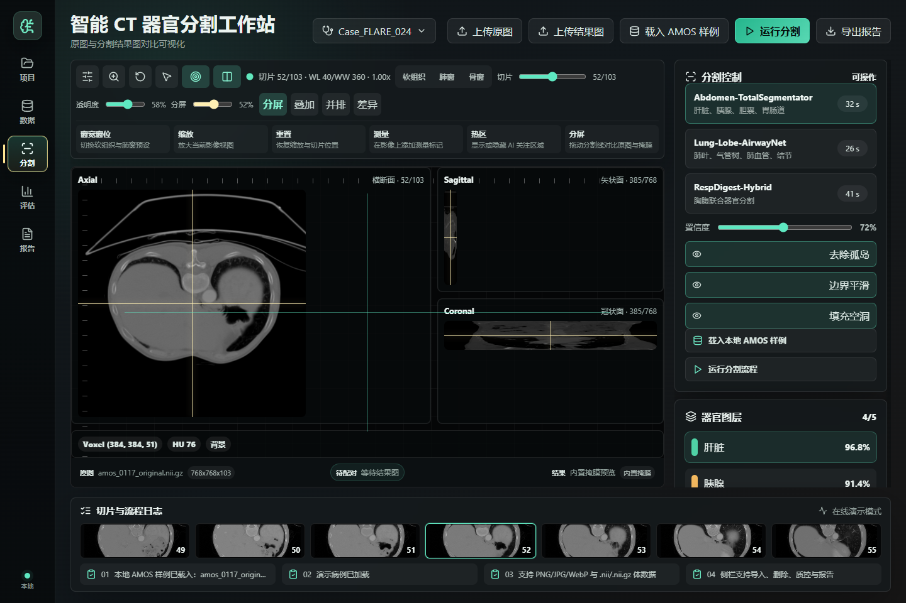
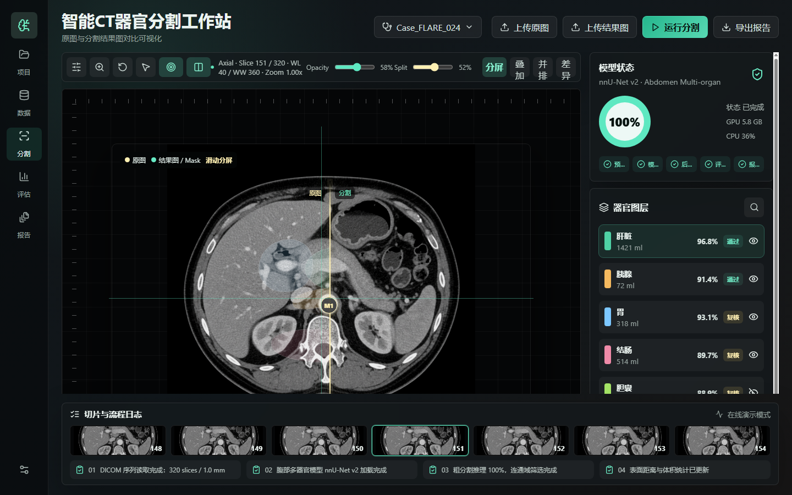

# 智能 CT 器官分割工作站

> 面向腹部 CT 多器官分割的本地 GUI 原型 — React + TypeScript + Vite 前端，FastAPI + nnUNetv2 后端。
> 目标作品：**中国生物医学工程竞赛「呼吸-消化系统疾病」赛道**。

[](https://www.python.org/)
[](https://react.dev/)
[](https://www.typescriptlang.org/)
[](https://fastapi.tiangolo.com/)
[](https://github.com/MIC-DKFZ/nnUNet)
[](#)



## 项目亮点

- **三正交视图联动**：Axial / Sagittal / Coronal 实时联动，十字线拖动、窗宽窗位、mask 叠加 / 滑动对比 / 差异模式 — 鼠标拖动期间用 `interactive` 轻量预览，释放后自动恢复 `full` 完整质量渲染。
- **真实 nnUNetv2 在线推理**：集成本地 nnUNetv2 model folder，可选 `quality` / `fast` 两档 profile；支持本地 fold0 保底路径或服务器 5-GPU / 5-fold soft ensemble（`runtime_target=local|server`）。
- **6 类医学影像指标评估**：Dice / IoU / Pixel Accuracy / Hausdorff Distance / HD95 / ASD，按 NIfTI spacing 计算 mm 单位；`surface_distances()` 单 label 距离计算 2 EDT 合并，实测 validation 阶段 2.3× 加速。
- **跨数据集自动 taxonomy remap**：FLARE22 / AMOS22 标签 ID 语义不同时，后端 `server/taxonomy.py` 自动识别并按器官名重映射；上传自定义 NIfTI 时 dataset_hint 自动清空避免错误继承。
- **历史预测结果秒级回填**：cache_key 7 字段（`input_sha256 + checkpoint_sha256 + dataset_name + configuration + labels_source + runtime_target + inference_options`）精确隔离，cache hit < 5s 返回，validation 按当前请求标签重算。
- **临床报告风格 HTML 导出**：封面 + 执行摘要 + TOC + §1–§8 章节 + 公式 tip + 严重度分布图 + A4 打印页眉页码；JSON `schema_version 1.1` 含 quantification；PDF 走浏览器原生打印，不引第三方库。
- **SSE 实时推理进度**：长耗时推理不卡顿；心跳事件防误判、取消状态优先、自动退避重连 200ms→2s × 3 次。

## 快速上手（≤ 30 秒）

```bash
# 项目根目录下
& "D:\BME2026\BME_CT_Seg\nnunet_env\Scripts\python.exe" tools\start_local_demo.py
```

等 `Backend ready: 4 reference case(s)` 提示后，浏览器开 [http://127.0.0.1:5173/](http://127.0.0.1:5173/) 即可。

> 自动化 / SSH 场景必须用 `Start-Process` 后台跑（前台跑会被工具超时连带 kill 整个进程组）。完整说明见 [`docs/quickstart-launch-guide.md`](docs/quickstart-launch-guide.md)。

## 项目截图

| 三正交联动 | 器官图层 + Dice 评分 | 临床报告（HTML）|
|:---:|:---:|:---:|
|  |  | *见下方报告特性段* |

> 截图来自本地实跑（RTX 4060，2D nnUNet，quality profile，AMOS 0117 cache hit）。真实数据 / checkpoint / 推理输出均不进入仓库。

## 核心架构

```
┌─────────────────────────┐    SSE / REST     ┌──────────────────────────┐
│  React + Vite 前端       │ ───────────────► │  FastAPI 后端             │
│  src/main.tsx (编排)     │                  │  server/main.py           │
│  src/components/Viewer   │  NIfTI download  │   ├─ job 生命周期 / SSE  │
│  src/imaging/* (几何)   │ ◄───────────────  │   ├─ 缓存 + validation   │
│  src/inference/* (通信) │                  │   ├─ taxonomy.py (remap) │
│  src/report/* (报告)    │                  │   └─ server_inference.py │
└─────────────────────────┘                  │      (5-fold ensemble)   │
       │                                       └──────────────────────────┘
       │ 体积 / 截面积 / 包围盒 / 量化                       │
       ▼                                                  ▼
  src/imaging/quantification.ts                nnUNetv2 (本地 / 服务器 GPU)
```

详细讲解见 [`CODE_MODULE_GUIDE.md`](CODE_MODULE_GUIDE.md)。

## 当前主要能力（2026-06-06）

| 模块 | 能力 | 验证基线 |
|---|---|---|
| CT 浏览 | `.nii` / `.nii.gz` 解析；Axial / Sagittal / Coronal；窗宽窗位预设；十字线 + 体素坐标实时显示 | `tests/imagingLogic.test.ts` |
| 在线推理 | 本地 nnUNetv2 / 服务器 5-fold ensemble；SSE 进度 + 心跳 + 自动重连 + 取消 | `start_local_demo.py` 后端启动 + 4 例参考病例已暴露 |
| 缓存回填 | cache_key 7 字段精确隔离；cache hit < 5s；historical validation 摘要 | AMOS `aea4e7cdbaf0` / FLARE `02da885c97d8` |
| 质量评估 | 6 类指标（Dice / IoU / Pixel Accuracy / HD / HD95 / ASD）；2 EDT 距离计算 | AMOS 0117 quality cache hit validation 38.86s → 16.78s |
| Taxonomy remap | FLARE22 ↔ AMOS22 自动检测 + 器官名重映射；显式 `label_taxonomy` 三选项 | `a717dacf42d3` mean Dice 0.926 |
| 报告导出 | HTML 临床报告风格 / JSON schema 1.1 / PDF（A4 + 页眉页码） | `tests/imagingLogic.test.ts` source-grep 守护 |
| 局域网 / 服务器 | `VITE_API_ENDPOINT` + `SEGMENTATION_ALLOWED_ORIGINS`；校园网 Windows → Ubuntu 5GPU | `1780153055202` FLARE 服务器轮次 |

正式 AMOS 基线：job `b3c528cc9e20`，quality profile，**mean Dice 0.924780**。

## 文档导航

按使用场景挑入口：

- **新同学 / 临时调试 — 起 GUI**：[`docs/quickstart-launch-guide.md`](docs/quickstart-launch-guide.md)（最简 / 136 行）
- **演示当天 — 一屏快查**：[`docs/demo-day-checklist.md`](docs/demo-day-checklist.md)（5 步流程 + 前置确认）
- **Cache demo 复跑 — 详细手册**：[`docs/local-cache-demo-runbook.md`](docs/local-cache-demo-runbook.md)（cache_key 7 字段）
- **工程详版（含本地运行 / 服务器部署 / API 概览 / 限制）**：[`README.zh-CN.md`](README.zh-CN.md)（388 行）
- **代码模块讲解**：[`CODE_MODULE_GUIDE.md`](CODE_MODULE_GUIDE.md)
- **完整 review / 历史实验**：[`REVIEW.md`](REVIEW.md) / [`SEGMENTATION_EXPERIMENT_COMPARISON.md`](SEGMENTATION_EXPERIMENT_COMPARISON.md)
- **验收口径**：[`ACCEPTANCE.md`](ACCEPTANCE.md)
- **最新几轮推理记录**：[`SEGMENTATION_RECENT_ROUNDS.md`](SEGMENTATION_RECENT_ROUNDS.md)
- **当前指标聚合**：[`SEGMENTATION_METRICS_SUMMARY.md`](SEGMENTATION_METRICS_SUMMARY.md)
- **跨数据集评估讨论**：[`docs/competition/BME_COMPETITION_GUIDE.md`](docs/competition/BME_COMPETITION_GUIDE.md)

## 仓库边界

不提交真实 CT / NIfTI / checkpoint / 推理输出 / 私有 registry / `.env`。`.gitignore` 屏蔽 `nnunetv2_files/`、`server/work/`、`*.nii` / `*.nii.gz` / `*.pth`。

局域网与公网入口策略：优先 LAN / Tailscale / WireGuard；公网入口必须鉴权 + HTTPS + 大文件上传限制 + SSE 反代参数，不长期开放未授权 CORS。

## 致谢

- [nnU-Net](https://github.com/MIC-DKFZ/nnUNet) — Isensee et al., 2021
- [AMOS22](https://amos22.grand-challenge.org/) / [FLARE22](https://flare22.grand-challenge.org/) 数据集
- 中国生物医学工程竞赛「呼吸-消化系统疾病」赛道

---

中文为主体；技术字段（job id / Dice / IoU / profile / API 路径 / checkpoint hash）保留英文。
详细工程说明见 [`README.zh-CN.md`](README.zh-CN.md)。